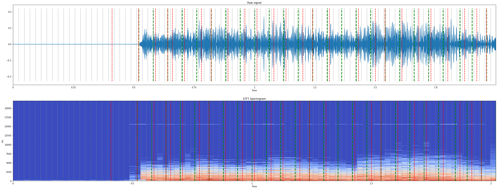
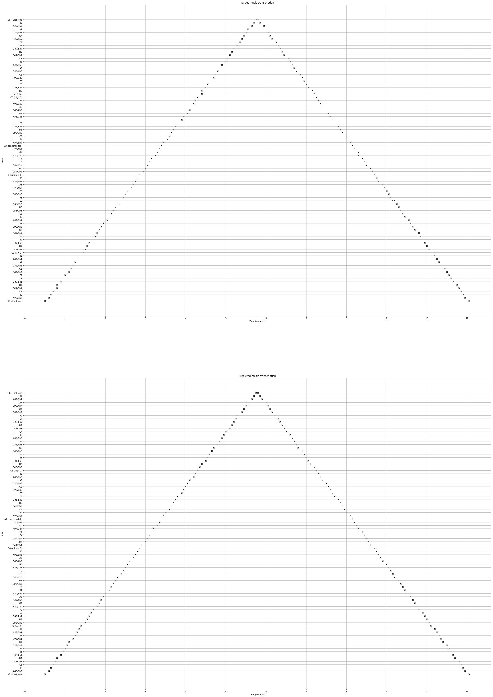

“Baseline models on MAPS (piano) dataset.

Target:
1. CNN on a sliding window for note recognition.
2. A blog explaining pre/post processing and limitations of the model

Ambitious:
1. CNN based onset (when did the note start) prediction model
2. Combine onset+note predictions”

# Transcribing music using machine learning!

I’m building a system that can automatically generate sheet music for
any song from audio such that a musician can use it to play the song!

For first steps, I decided to implement a very simple model for the task
to establish a baseline and to also understand the data better. Details
about this follow in the post below.

For the lazy or the non-technical folks, I've presented a sample result
from the progress so far first.

## A high-level overview of the solution

I am first working with a well-known piano music data set (details below)
and will extend this to the guitar data set in the coming weeks.

The problem of going from an audio file to the notes can be broken
down into two parts:
1. Finding the note `onsets` (where does the note start? This would
    correspond to striking the piano key)
2. Identifying the note pitch (e.g: was it an A1 or an E?)

Following the same paradigm, here is what my pipeline does:
1. Read the audio file and convert it to processed format
2. Detect the note onsets
3. For each onset, classify the notes being played

## The very first results!
[Here is a sample piano music file from the MAPS data set]().

### Onset prediction
The onset prediction task would detect where each new note starts hence
splitting the audio into segments between the onsets.

To "visualize" this better, I've added a "pause" (no sound) between
each pair of segments. You should now hear one note, followed by a
pause, then the next note, and so on.

- [Here is how it should ideally sound - based on annotations]().
- [Here is what the model predicts]().

Below is a visualization of the first 2 seconds of the signal:

The target (annotated) onsets are marked in green, while the predicted
onsets are marked in red.

### Note Transcription
A typical piano has 88 keys (each corresponding to one note).

The image below shows the actual (annotated) transcription and the
predicted transcription from the model:

We can see that the model does a pretty good job of predicting the notes
at the right times!

In the coming weeks, I'll write some code to play the "reconstructed"
song from the predicted transcription so that it's easier to make sense
of these results.

### A note about the results and the next steps
The qualitative results look pretty good! However, I must warn you that
this file was cherry-picked since the model worked well on this.

I faced some issues with the model generalization (it did not do as well
on all the files) and training. Improving the model and the training
procedure is a part of my next steps. Also, I'll work on making a
similar baseline model for the guitar music now.

## Details

In this section, I'll assume that the reader has a basic understanding
of Convolutional Neural Networks and signal processing.

**All the code used for training / generating results is present in
[this](https://github.com/anujkhare/music) repository!** I used
**PyTorch** for implementing the model.

### What did I want to achieve with the baseline?
1. Learn about and understand the data, signal processing, pre-processing, etc.
2. Establish the end-to-end pipeline for training, evaluation, and
    visualization. Now, I can focus on improving the model itself.
3. See how far a very simple model can go.

### Dataset

For first steps, I chose to work on the MAPS database, which is a
standard database for automatic music transcription on Pianos.
Note that the task is the same and hence the same models that work for
piano music should ideally work for guitar music as well (almost).

The reasons that I chose to start with MAPS were two-fold:
1. It is a well established data-set with many results posted on it
    making it an easy choice for comparison and validation of my models.
2. I think that it might be easier to work with piano notes since guitar
    music may have more nuances (muted strings, hammer-ons, pull-offs,
    etc.) which I want to avoid for the base-line model.

[You can find the MAPS data here](http://www.tsi.telecom-paristech.fr/aao/en/2010/07/08/maps-database-a-piano-database-for-multipitch-estimation-and-automatic-transcription-of-music/).

### Pre-processing
All the audio files in the MAPS dataset are sampled at 44kHz.

1. Randomly crop a 2 second segment from the input file
2. Compute the Short-Time-Fourier-Transform features of the audio crop.
    I used a window length and hop length of 1024 each. This means
    that all the windows are non-overlapping. There will be 87 windows
    per one second of the audio (sampled at 44kHz)
3. For each window, compute the target labels as follows:
    1. onset: if there is at least one onset in the window, mark the
        window as 1 (has an onset), else 0 (does not have an onset)
    2. notes: for each onset in the window, get the corresponding note
        Hence, if a window has an onset, it would have one or more
        target notes, else no notes.

### Task formulation
Based on the description of the data above, the two tasks are:
1. Onset prediction: binary prediction for each window of the audio
2. Note prediction: a multi-label classification for each window of the
    audio (there can be more than one note onset in a window)

### Model
I implemented a simple fully-convolutional CNN. It makes two predictions
per window:
1. binary onset classification
2. 88 way note classification

[You can find the model code here](https://github.com/anujkhare/music/blob/71f662747c02be50e75274a6b98f926ec345affc/src/models/frame_cnn.py#L45).

### Loss function and training
A simple Binary Cross Entropy loss (with weights for class-imbalance)
is used for the onset prediction. A Binary Cross Entropy With Logits
(for numerical stability) is used for the multi-label classification.

For training, in each epoch:
1. Randomly choose one audio file
2. Apply pre-processing as described above (randomly choosing a 2s crop)
3. Get the model predictions
4. Calculate loss, backpropogate
5. Validate and visualize the results

### Post-processing
1. Get the predicted onset times: assume that each onset lies at the
    center of the window (1024 frames of audio).
2. Only in the windows with a predicted onset, get the note predictions.

### Detailed results
- Comparison with onset base-line
- Small vs large data-set

- Visualization of the signal, predicted and actual onsets
- Visualization of the notes??

### Next steps
1. Improving model generalization: I have a few thoughts on why the
    generalization is poor right now:
    1.
2. Base-line model on the [guitarset dataset](https://github.com/marl/GuitarSet).