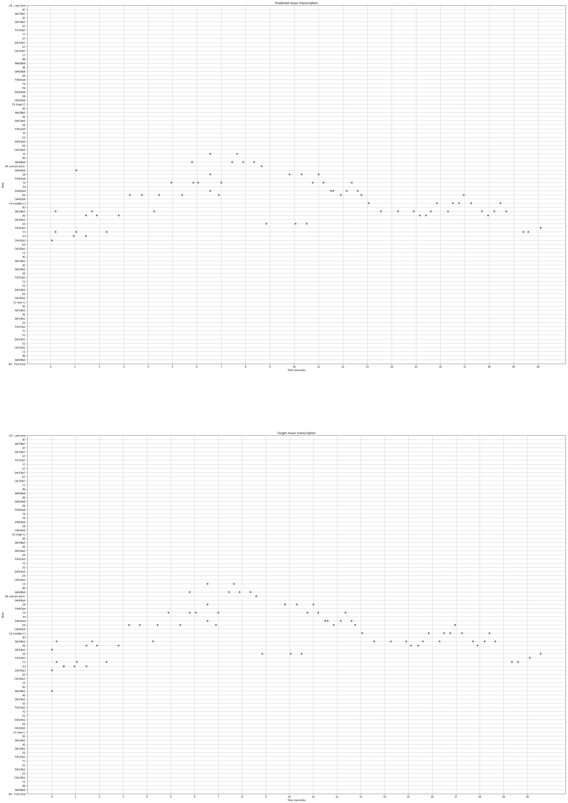

# Transcribing music using machine learning!

## Background
I started out with the objective of automatic guitar music transcription
(song -> guitar tabs).

The goal for my first month was to understand the landscape of this
problem and validate feasibility by training existing models on existing
datasets and making this work for "clean guitar music".

## Week's progresss!

### Getting the baseline model to generalize
Last week, I implemented a very simplistic base-line model last week as [described
in this post](1-baseline-model.md). As mentioned earlier, it was not
"generalizing" well when trained with all the songs in the dataset.

As suspected, it was because some songs were very short (<3s) while others
were very long (~4-5 minutes) and I was still randomly picking each
song with the same probability and then cropping it. So, my model would
see all the parts of the shorter songs a lot more than any part of the
longer songs during training, causing a "bias".
[Here's where I made the fix](https://github.com/anujkhare/music/commit/e2df09ce6a246ed809100300bce12c5ab66b406d).

### Training the base-line model on the GuitarSet data-set
It turned out to be fairly straight-forward since I just needed to convert
 the data loader to make this work.

Here is a target and predicted transcription from the validation set:

This corresponds to [this song]().

As before, I'm still not able to "play / hear" the transcribed music.
This is because I am not yet predicting the offsets (when the note ends).

<!--I also tested this on audio from real YouTube videos. It did surprisingly-->
<!--okay,-->

### Exploring other solutions

I spent a fair amount of time this week trying to explore the existing
solutions that solve one or more parts of this problem.

There are a whole bunch of notation software like MagicScore Audioscore,
Guitar Pro, Finale, Akoff, etc. that are primarily targeted towards
music composers.

There's also a fair amount of work in Automatic Music Transcription
using Machine Learning [1](https://ieeexplore.ieee.org/document/7178333),
[2](http://ismir2015.uma.es/articles/227_Paper.pdf), [3](), etc. The most notable of
these is Google Magenta's piano music transcription. They have an
[amazing demo as well](https://magenta.tensorflow.org/oaf-js)!

I also found [AnthemScore](https://www.lunaverus.com/) which is quite
similar (but better) to the baseline model that I created!
It also works for piano music (it was trained on the MAPS dataset).

## The way forward

For the first month, I just wanted to understand the problem in depth
and validate the technical feasibility, which I'm pretty happy about.

While my base-line model works, Google Magenta's Onsets and Frames model
is a much improved version of it. I'm going to build on top of it and
focus on getting a end-to-end usable solution first.

Here are the open problems that I'm going to tackle in order of priority:
1. Making it work on real videos, scoped down to just guitar solos and finger-picking performances
    1. Create a "real-world" test set from YouTube videos
    2. (Qualitatively) Evaluate the models on these videos

    I know that I'll hit some of the problems that I have touched upon
    earlier: multiple instruments playing at the same time and noise
    being the biggest ones. The idea is to figure out which the biggest
    problem to solve is and how easy it is.

2. Evaluate approaches for going from MIDI -> Guitar tabs

    This is not easy since MIDI (or sheet music) just contains
    information about which notes are being played, but not which
    strings / frets to play them on. There are multiple configurations
    possible always.

3. Create a usable online demo for guitar music transcription for others to use

4. User research: there are two major user profiles - beginners (like myself who
    would prefer ease-of-use) and advanced musicians (who would prefer
    control and the ability to edit or correct and possibly export the
    transcription)

5. More competitive analysis against existing tools for my "real-world"
    test set. I had done this once earlier and most tools weren't very
    accurate. I have since found a couple more tools that I'd like to
    benchmark against.

The findings from these will determine how I proceed with this project.
